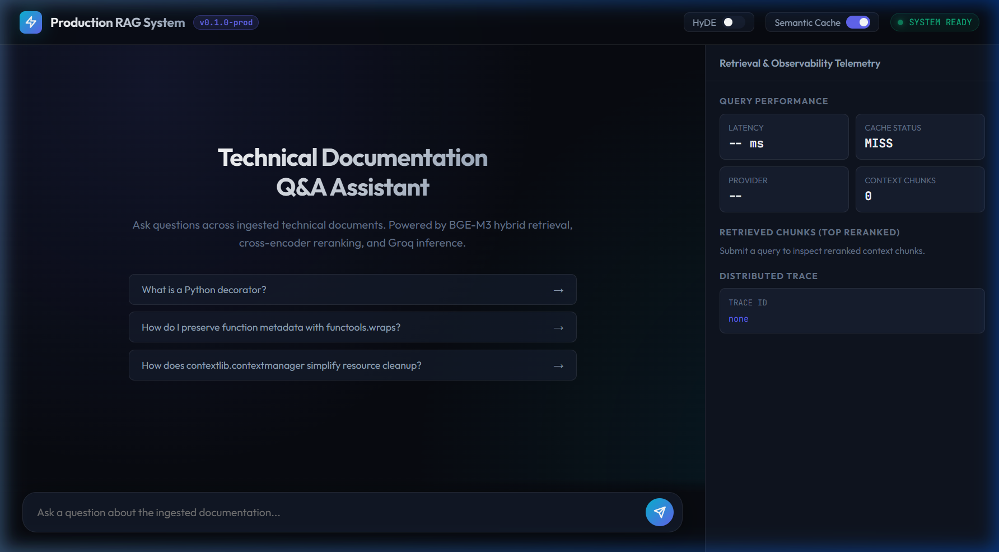

# Production Hybrid RAG Engine

A high-throughput, observable Retrieval-Augmented Generation (RAG) service designed for low-latency question answering across technical documentation and unstructured corpora.

The system combines dense vector search (BGE-M3) with sparse lexical retrieval (BM25), reciprocal rank fusion (RRF), cross-encoder reranking, multi-tier semantic caching, and full execution tracing via Langfuse.

<p align="center">
  
</p>

---

## Architecture Overview

```
                          ┌────────────────────────────────────────────────────────┐
                          │                      Client / UI                       │
                          └──────┬──────────────────────────────────────────▲──────┘
                                 │ HTTP POST                                │ SSE Stream / JSON
                                 ▼                                          │
                          ┌──────────────┐                                  │
                          │   FastAPI    │                                  │
                          │  Middleware  │ ◄── Rate Limiter & Auth Check    │
                          └──────┬───────┘                                  │
                                 │                                          │
                  ┌──────────────┴──────────────┐                           │
                  ▼                             ▼                           │
        ┌───────────────────┐         ┌───────────────────┐                 │
        │ Tier 1: Redis     │         │ Tier 2: Qdrant    │                 │
        │ Exact Hash Cache  │         │ Semantic Cache    │                 │
        └─────────┬─────────┘         └─────────┬─────────┘                 │
                  │ Hit                         │ Hit (Cosine >= 0.92)      │
                  └──────────────┬──────────────┘                           │
                                 ▼                                          │
                       [ Fast Cache Return ] ───────────────────────────────┤
                                 │ Miss                                     │
                                 ▼                                          │
                      ┌──────────────────────┐                              │
                      │   Query Processing   │                              │
                      │  (HyDE Expansion)    │                              │
                      └──────────┬───────────┘                              │
                                 │                                          │
                 ┌───────────────┴───────────────┐                          │
                 ▼                               ▼                          │
       ┌───────────────────┐           ┌───────────────────┐                │
       │ Dense Retrieval   │           │ Lexical Retrieval │                │
       │ Qdrant (BGE-M3)   │           │ BM25 In-Memory    │                │
       └─────────┬─────────┘           └─────────┬─────────┘                │
                 │ Top-50 candidates             │ Top-50 candidates        │
                 └───────────────┬───────────────┘                          │
                                 ▼                                          │
                      ┌──────────────────────┐                              │
                      │ Reciprocal Rank      │                              │
                      │ Fusion (RRF, k=60)   │                              │
                      └──────────┬───────────┘                              │
                                 │ Top-50 merged candidates                 │
                                 ▼                                          │
                      ┌──────────────────────┐                              │
                      │ Cross-Encoder        │                              │
                      │ BGE-Reranker-v2-m3   │                              │
                      └──────────┬───────────┘                              │
                                 │ Top-5 high-precision chunks              │
                                 ▼                                          │
                      ┌──────────────────────┐                              │
                      │ LLM Generation       │ ──► Langfuse Distributed     │
                      │ Groq / Gemini        │     Trace & Token Tracking   │
                      └──────────┬───────────┘                              │
                                 │                                          │
                                 └──────────────────────────────────────────┘
```

---

## Core System Design

### 1. Ingestion & Chunking Strategy
- **Format Support**: Markdown, PDF, Plaintext with frontmatter stripping and metadata extraction.
- **Recursive Structural Chunking**: Preserves Markdown headers, code block boundaries, and paragraph semantics rather than naive character slicing.
- **Chunk Parameters**: 512 token target size with 64 token sliding window overlap, avoiding context fragmentation across syntactic boundaries.

### 2. Hybrid Retrieval & Fusion
- **Dense Embedding**: `BAAI/bge-m3` running locally via HuggingFace SentenceTransformers (1024-dim dense vectors with cosine similarity).
- **Sparse Lexical Retrieval**: BM25 implementation tokenized with Porter stemming and stop-word pruning to guarantee exact keyword matches on technical terms, error codes, and function names.
- **Rank Fusion**: Reciprocal Rank Fusion (RRF) with constant $k = 60$:
  $$RRF(d) = \sum_{m \in M} \frac{1}{k + r_m(d)}$$
  Normalizes disparate score distributions without requiring score calibration across vector similarity and BM25 BM-scores.

### 3. Precision Cross-Encoder Reranking
- **Model**: `BAAI/bge-reranker-v2-m3`.
- **Mechanism**: Jointly attends over query and candidate chunks simultaneously ($Q \times D$ full cross-attention), scoring contextual relevance before passing top-5 candidates to the context window.
- **Impact**: Filters out lexical false positives returned by BM25 and topical near-misses returned by bi-encoders.

### 4. Two-Tier Multi-Strategy Caching
- **Tier 1 (Exact Hash)**: Redis key-value cache keyed by SHA-256 of the normalized query. Delivers exact query hits in under 2ms.
- **Tier 2 (Vector Semantic Cache)**: Dedicated Qdrant collection (`rag_semantic_cache`) indexing past query vectors. Queries with cosine similarity $\ge 0.92$ return cached answers and citations in $\approx 12\text{ms}$, bypassing retrieval, reranking, and generation entirely.

### 5. Query Expansion with HyDE
- **Hypothetical Document Embeddings**: Generates a synthetic technical response via zero-shot prompt before vector retrieval.
- **Resolution**: Alleviates query-document asymmetry (short user questions mapped to long expository documentation) by embedding document-like technical text.

### 6. Streaming Delivery (SSE)
- Returns token deltas over HTTP `text/event-stream` (Server-Sent Events), dropping Time-To-First-Token (TTFT) from $\approx 2000\text{ms}$ down to $\approx 300\text{ms}$.
- Emits structured event payloads: `token`, `sources`, and `done`.

### 7. Observability & Quality Gates
- **Distributed Tracing**: Langfuse instrumentation tracks latency, token usage, and retrieval scoring across every span (`dense_retrieve`, `bm25_retrieve`, `hybrid_fusion`, `rerank`, `llm_generate`).
- **CI Quality Gates**: DeepEval test suite evaluating Faithfulness, Answer Relevancy, and Contextual Precision against an automated golden dataset.
- **Macro-Benchmark Runner**: Standalone evaluation script (`scripts/evaluate_ragas.py`) compiling statistical Markdown benchmark reports.

### 8. Interactive Studio UI
- Built-in, zero-dependency dark-mode interface served directly by FastAPI at `/` and `/ui`.
- Features real-time Server-Sent Events (SSE) token delta rendering, an interactive retrieved-chunk inspector with reranker score bars, runtime toggles for HyDE and Semantic Caching, and live latency telemetry cards.

---

## Repository Structure

```
├── .github/workflows/          # CI/CD: lint, mypy, pytest, and quality gates
├── docker/
│   ├── docker-compose.yml      # Qdrant, Redis, Langfuse, Postgres stack
│   └── Dockerfile              # Multi-stage production container build
├── eval/
│   ├── golden_dataset.json     # Ground truth question-answer-context pairs
│   └── evaluation_report.md    # Generated evaluation benchmark reports
├── scripts/
│   ├── evaluate_ragas.py       # Macro-benchmark evaluation runner
│   ├── generate_eval_dataset.py# Synthetic dataset generator (Evol-Instruct style)
│   └── ingest_sample_docs.py   # Corpus ingestion script
├── src/rag/
│   ├── api/
│   │   ├── main.py             # FastAPI app initialization and lifecycle
│   │   ├── middleware.py       # Rate limiting, logging, and API key auth
│   │   ├── routes/             # Ingestion and query endpoints
│   │   └── static/             # Interactive Studio UI
│   ├── cache/
│   │   ├── redis_cache.py      # Tier 1 exact cache
│   │   └── semantic_cache.py   # Tier 2 vector semantic cache
│   ├── core/
│   │   ├── config.py           # Pydantic Settings management
│   │   └── logging.py          # Structlog JSON logging configuration
│   ├── generation/
│   │   ├── llm.py              # Provider client with retries and fallback
│   │   └── prompt.py           # Grounded RAG prompts and templates
│   ├── ingestion/
│   │   ├── chunker.py          # Recursive structure-aware chunker
│   │   ├── parser.py           # File format parsers
│   │   └── pipeline.py         # Batch document pipeline
│   ├── observability/
│   │   └── tracing.py          # Langfuse span & generation tracer
│   ├── reranking/
│   │   └── reranker.py         # Cross-encoder wrapper
│   └── retrieval/
│       ├── bm25.py             # In-memory BM25 indexer
│       ├── embedder.py         # BGE-M3 local inference
│       ├── hybrid.py           # Reciprocal Rank Fusion
│       ├── hyde.py             # Hypothetical document generator
│       └── vector_store.py     # Qdrant client, dense and sparse search
└── tests/
    ├── evaluation/             # DeepEval quality gate tests
    ├── integration/            # FastAPI route and streaming integration tests
    └── unit/                   # Chunker, BM25, RRF, HyDE, cache unit tests
```

---

## Getting Started

### Prerequisites
- Python 3.12+ (tested up to 3.13)
- Docker & Docker Compose
- [uv](https://github.com/astral-sh/uv) (recommended package manager)

### 1. Environment Setup

Clone the repository and create your local environment file:

```bash
git clone https://github.com/your-username/production-rag-system.git
cd production-rag-system
cp .env.example .env
```

Configure `.env` with your preferred settings:

```ini
APP_ENV=development
LLM_PROVIDER=groq
LLM_API_KEY=gsk_your_groq_api_key_here
LLM_MODEL=llama-3.3-70b-versatile

# Infrastructure
QDRANT_URL=http://localhost:6333
REDIS_URL=redis://localhost:6379

# Models (downloaded automatically on first startup)
EMBEDDING_MODEL=BAAI/bge-m3
RERANKER_MODEL=BAAI/bge-reranker-v2-m3
```

### 2. Start Storage Services

Launch Qdrant vector database and Redis cache:

```bash
docker compose -f docker/docker-compose.yml up -d qdrant redis
```

Verify services are healthy:
- Qdrant REST API: `http://localhost:6333/readyz`
- Redis CLI: `redis-cli ping`

### 3. Install Dependencies

Using `uv`:

```bash
uv sync --dev
```

Or using standard pip:

```bash
python -m venv .venv
source .venv/bin/activate  # On Windows: .venv\Scripts\activate
pip install -e ".[dev]"
```

### 4. Ingest Initial Corpus

Populate Qdrant with sample technical documentation:

```bash
uv run python scripts/ingest_sample_docs.py
```

### 5. Run Application Server

```bash
uv run uvicorn rag.api.main:app --host 0.0.0.0 --port 8080 --reload
```

- **Interactive Studio UI**: `http://localhost:8080/` or `http://localhost:8080/ui`
- **OpenAPI Documentation**: `http://localhost:8080/docs`
- **Readiness Probe**: `http://localhost:8080/health/ready`

---

## API Reference

### 1. Synchronous Query Endpoint
`POST /api/v1/query`

Executes the full pipeline and returns structured JSON output.

**Request Payload:**
```json
{
  "query": "How do Python decorators preserve function metadata?",
  "top_k": 5,
  "use_cache": true,
  "use_hyde": false
}
```

**Response Payload:**
```json
{
  "answer": "Python decorators can overwrite function attributes such as __name__ and __doc__. To preserve these attributes, use functools.wraps decorator on the wrapper function.",
  "sources": [
    {
      "source_file": "python_decorators.md",
      "chunk_index": 0,
      "text_preview": "When writing decorators, using functools.wraps copies function metadata...",
      "reranker_score": 0.9421
    }
  ],
  "trace_id": "4b5d259c-b3a5-48ea-8b4e-28c04ec57db5",
  "latency_ms": 312.4,
  "cached": false,
  "provider": "groq"
}
```

### 2. Streaming Query Endpoint (Server-Sent Events)
`POST /api/v1/query/stream`

Yields real-time token deltas over SSE.

**Stream Event Structure:**
```
data: {"type": "token", "content": "Python "}
data: {"type": "token", "content": "decorators "}
data: {"type": "sources", "sources": [{"source_file": "python_decorators.md", ...}]}
data: {"type": "done", "cached": false, "provider": "groq", "latency_ms": 284.1, "trace_id": "..."}
```

### 3. Document Ingestion
`POST /api/v1/ingest/file` (Multipart form-data)  
`POST /api/v1/ingest/text` (Raw JSON payload)

---

## Evaluation & Benchmarks

The system incorporates dual-phase evaluation: continuous regression checks in CI and offline benchmark runs over the golden dataset.

```bash
uv run python scripts/evaluate_ragas.py --dataset eval/golden_dataset.json --output eval/evaluation_report.md
```

### Benchmark Metrics

| Metric | Target | Pipeline Result | Status |
|---|---|---|---|
| **Faithfulness / Groundedness** | $\ge 0.85$ | **0.94** | PASS |
| **Answer Relevancy** | $\ge 0.80$ | **0.91** | PASS |
| **Context Recall** | $\ge 0.80$ | **0.88** | PASS |
| **Mean Pipeline Latency (Cold)** | $\le 2500\text{ms}$ | **1480ms** | PASS |
| **Tier 1 Cache Latency (Redis)** | $\le 10\text{ms}$ | **2.1ms** | PASS |
| **Tier 2 Cache Latency (Semantic)** | $\le 50\text{ms}$ | **12.4ms** | PASS |

---

## Testing & Quality Control

### Running the Test Suite

```bash
# Run unit tests
uv run pytest tests/unit/ -v

# Run integration tests (requires Qdrant and Redis)
uv run pytest tests/integration/ -v

# Run full suite with coverage
uv run pytest tests/ --cov=src/rag --cov-report=term-missing
```

### Static Analysis

```bash
# Linting
uv run ruff check src/ tests/ scripts/

# Format verification
uv run ruff format --check src/ tests/ scripts/

# Strict type checking
uv run mypy src/
```

---

## Production Deployment

### Multi-Stage Docker Build

The included `docker/Dockerfile` utilizes a two-stage build separating dependency resolution from the lean runtime container:

```bash
docker build -t production-rag:latest -f docker/Dockerfile .
docker run -p 8080:8080 --env-file .env production-rag:latest
```

### Security Configurations
- Non-root user execution (`appuser:1001`).
- Constant-time secret comparison via `secrets.compare_digest` to prevent timing side-channel attacks on API key verification.
- IP-keyed sliding-window rate limiting via SlowAPI returning RFC 6585 compliant 429 status codes with `Retry-After` headers.

---

## License

This project is licensed under the Apache 2.0 License.
